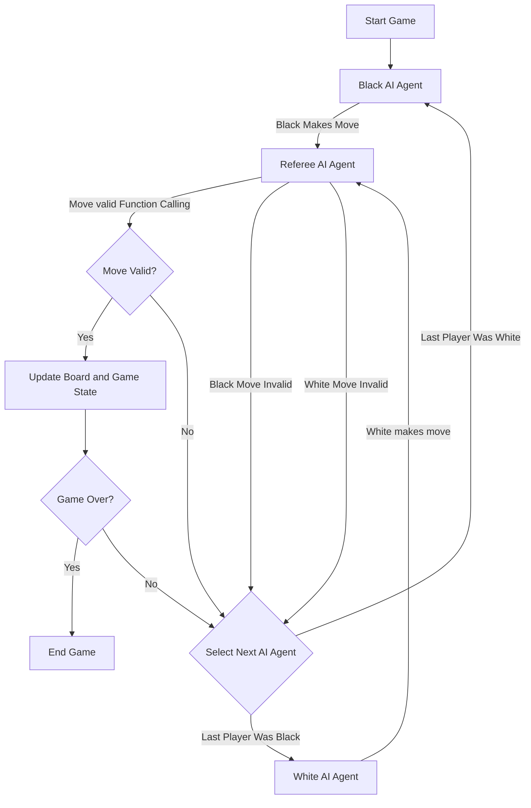

```mermaid
graph TD
    A[Start Game] --> B[Black AI Agent]
    B -->|Black Makes Move| C[Referee AI Agent]
    C -->|Move valid Function Calling| D{Move Valid?}
    D -->|Yes| G[Update Board and Game State]
    G --> E{Game Over?}
    D -->|No| H{Select Next AI Agent}
    C -->|Black Move Invalid| H
    E -->|Yes| F[End Game]
    E -->|No| H
    H -->|Last Player Was White| B
    H -->|Last Player Was Black| I[White AI Agent]
    I -->|White makes move| C
    C -->|White Move Invalid| H
```