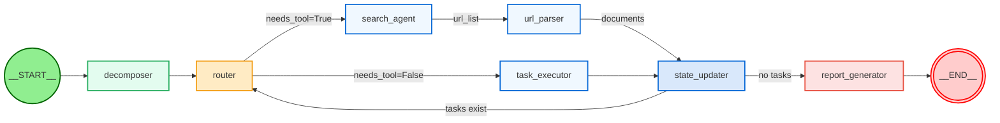

```mermaid
graph LR
    %% Define Styles
    style A fill:#90ee90,stroke:#006400,stroke-width:2px
    style B fill:#e3fcef,stroke:#27ae60,stroke-width:2px
    style C fill:#ffebc4,stroke:#f39c12,stroke-width:2px
    style D fill:#f0f8ff,stroke:#0366d6,stroke-width:2px
    style E fill:#f0f8ff,stroke:#0366d6,stroke-width:2px
    style F fill:#d9e8fb,stroke:#0366d6,stroke-width:2px
    style G fill:#fde2e2,stroke:#e74c3c,stroke-width:2px
    style H fill:#ffcccc,stroke:#ff0000,stroke-width:2px
    style I fill:#f0f8ff,stroke:#0366d6,stroke-width:2px

    A(("__START__")) --> B[decomposer]
    B --> C[router]
    
    C -->|needs_tool=True| D[search_agent]
    C -->|needs_tool=False| E[task_executor]
    
    D -->|url_list| I[url_parser]
    I -->|documents| F[state_updater]
    E --> F
    
    F -->|tasks exist| C
    F -->|no tasks| G[report_generator]
    
    G --> H((("__END__")))
```