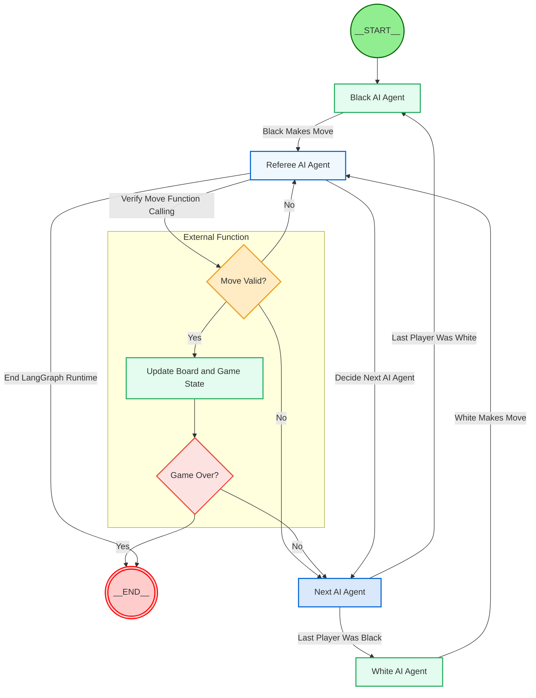

```mermaid
graph TD
    %% Define Styles
    style A fill:#90ee90,stroke:#006400,stroke-width:2px
    style B fill:#e3fcef,stroke:#27ae60,stroke-width:2px
    style C fill:#e3fcef,stroke:#27ae60,stroke-width:2px
    style D fill:#f0f8ff,stroke:#0366d6,stroke-width:2px
    style E fill:#ffebc4,stroke:#f39c12,stroke-width:2px
    style F fill:#fde2e2,stroke:#e74c3c,stroke-width:2px
    style G fill:#ffcccc,stroke:#ff0000,stroke-width:2px
    style H fill:#e3fcef,stroke:#27ae60,stroke-width:2px
    style I fill:#d9e8fb,stroke:#0366d6,stroke-width:2px

    %% Main Nodes
    A(("__START__"))
    B[Black AI Agent]
    C[White AI Agent]
    D[Referee AI Agent]
    G((("__END__")))
    I[Next AI Agent]

    %% Subgraph Function: External Function
    subgraph External Function
        direction TB
        E{Move Valid?}
        H[Update Board and Game State]
        F{Game Over?}
    end
    
    %% Define Connections
    A --> B
    B -->|Black Makes Move| D
    C -->|White Makes Move| D
    D -->|Verify Move Function Calling| E
    E -->|Yes| H
    E -->|No| I
    H --> F
    E -->|No| D
    F -->|Yes| G
    D -->|End LangGraph Runtime| G
    F -->|No| I
    D -->|Decide Next AI Agent| I
    I -->|Last Player Was White| B
    I -->|Last Player Was Black| C
```