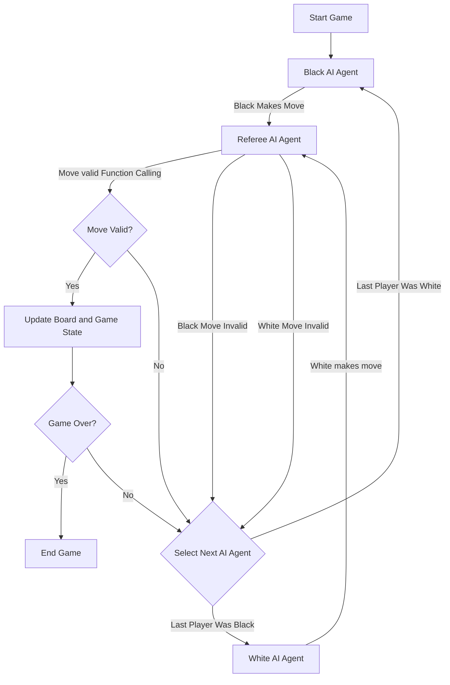

```mermaid
graph TD
    A[Start Game]
    B[Black AI Agent]
    C[Referee AI Agent]
    D{Move Valid?}
    E{Game Over?}
    F[End Game]
    G[Update Board and Game State]
    H{Select Next AI Agent}
    I[White AI Agent]
    
    A --> B
    B -->|Black Makes Move| C
    C -->|Move valid Function Calling| D
    D -->|Yes| G
    G --> E
    D -->|No| H
    C -->|Black Move Invalid| H
    E -->|Yes| F
    E -->|No| H
    H -->|Last Player Was White| B
    H -->|Last Player Was Black| I
    I -->|White makes move| C
    C -->|White Move Invalid| H
```